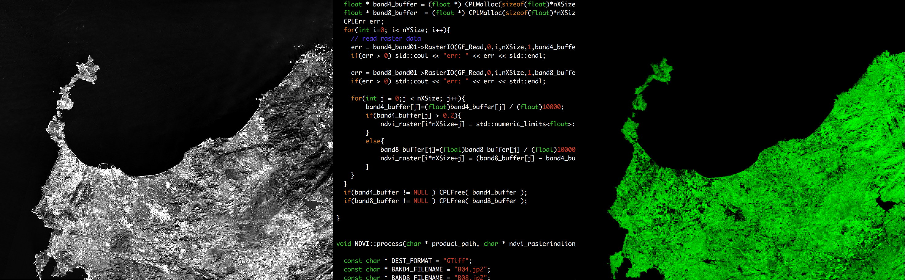

About
=====

   (options)

Ichnosat is an Open Source plugin based platform to
download an process satellite data written in
python and C++. Ichnosat is easy to configure and easy
to extend.
All source code is available on GitHub.

Ichnosat downloader gets automatically products from
Sentinel-2 aws portal. This downloader is multithreaded and
fully customizable.

Ichnosat *processing pipe* receive products from downloader
and processes products via C++ plugins. In the current
version the plugin available process the NDVI exploiting
GDAL library.

Ichnosat *processing pipe* is multithreaded, extendible
via C++ plugins and customizable.

- Cross-platform support
    - Ichnosat Platform provides the Docker containers

- Products Downloader
    - Get Sentinel-2 data from  `Sentinel-2 on AWS <http://sentinel-pds.s3-website.eu-central-1.amazonaws.com/>`_
    - Customizable properties:
        - Tiles to download
        - Files to download for each tile
        - Date interval (Sensing time)
        - Number of parallel downloads in the same time

- Products Processor
    - Plugin based: the processors are extendible C++ Shared Libraries
    - Customizable properties:
        - Number of parallel processing in the same time

