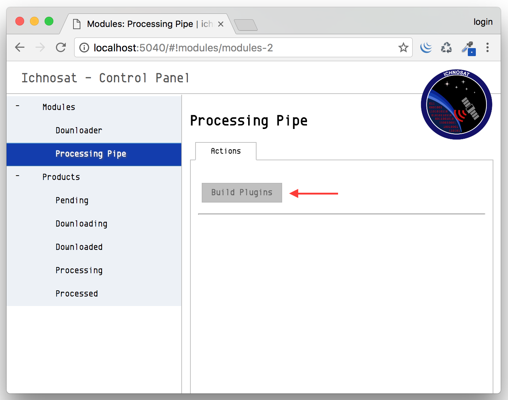

How to create a new plugin
==========================

Introduction
------------
The *Processor* is plugin based. Plugins are dynamic shared libraries written in C++.
Ichnosat runs plugins for every downloaded product, creating processed products.
The plugins are located in the path:

.. code-block:: bash

   /usr/ichnosat/src/core/processing_pipe/scientific_processor/src/plugins

The *Processor* expects that the plugin exposes a method with prototype:

.. code-block:: c

   extern "C" void process(char * product_path, char * destination_path)

Where:

- **product_path** is the path of folder where the download product data is located
- **destination_path** is the path of folder where the plugin will save the processed image

These attributes are autogenerated via the *Processor*, so you haven't to care about how to generate them, as
plugin developer, just care about to read and write from these paths.

Put the processing code inside the *process* method, implementing your algorithm, reading from *product_path* the downloaded images, and writing the result in the *destination_path*.

Plugin Creation
---------------

To create a new plugin is enough to make a new directory in the folder:

.. code-block:: bash

   /usr/ichnosat/src/core/processing_pipe/scientific_processor/src/plugins

with the name of your algorithm.
The source code of your Plugin must be C/C++, the file extension must be '.cc' and '.h'.

External libraries
------------------

We use `GDAL <http://www.gdal.org/>`_  in our NDVI algorithm implementation, to read and write *jp2* and *GeoTiff* images.
GDAL Library is available inside the environment of Ichnosat, so you haven't to care about how to install and/or configure GDAL, just include it in your C/C++ code.

Build a Plugin
--------------

Ichnosat contains the environment to compile the plugins. When Ichnosat starts (*docker-compose up*), Ichnosat compile all plugins
present in the path *usr/ichnosat/src/core/processing_pipe/scientific_processor/src/plugins*.
The logs of compilation are streamed in the *ichnosat.log* log file, located in the path:

.. code-block:: bash

   /usr/ichnosat/data_local/log/ichnosat.log

Example of compile process logs:

.. code-block:: bash

    02/07/2017 08:45:00 PM (PluginManager:compile_plugins) start
    02/07/2017 08:45:03 PM (ichnosat-manager) Completed compile NDVI plugin
    02/07/2017 08:45:03 PM (ichnosat-manager) COMPLETED compile scientific_processor plugins

It is also possible to compile plugins from Graphical User Interface, clicking on the button with label 'Build Plugins',
in the section 'Modules/Processing Pipe':

|
|

|
|

Anatomy of a Processor plugin
-----------------------------

An example of code structure of a plugin follows:

Implementation of *Processor* interface
~~~~~~~~~~~~~~~~~~~~~~~~~~~~~~~~~~~~~~~

.. code-block::

   //    ====================================================================================
   //     __     ______     __  __     __   __     ______     ______     ______     ______
   //    /\ \   /\  ___\   /\ \_\ \   /\ "-.\ \   /\  __ \   /\  ___\   /\  __ \   /\__  _\
   //    \ \ \  \ \ \____  \ \  __ \  \ \ \-.  \  \ \ \/\ \  \ \___  \  \ \  __ \  \/_/\ \/
   //     \ \_\  \ \_____\  \ \_\ \_\  \ \_\\"\_\  \ \_____\  \/\_____\  \ \_\ \_\    \ \_\
   //      \/_/   \/_____/   \/_/\/_/   \/_/ \/_/   \/_____/   \/_____/   \/_/\/_/     \/_/
   //
   //    ====================================================================================
   //
   //    Copyright (c) 2017 Yourname
   //
   //    LICENSE OF YOUR PLUGIN
   //
   //    ====================================================================================

   #include <string>
   #include <stdlib.h>
   #include <iostream>
   #include "gdal.h"
   #include "gdal_alg.h"
   #include "gdal_priv.h"
   #include "MyPlugin.h"

   extern "C" void process(char * product_path, char * destination_path)
   {
     MyPlugin * plugin = new MyPlugin();
     plugin->process(product_path, destination_path);
     delete plugin;

     return ;

   }

Class declaration
~~~~~~~~~~~~~~~~~

.. code-block:: c

   //    ====================================================================================
   //     __     ______     __  __     __   __     ______     ______     ______     ______
   //    /\ \   /\  ___\   /\ \_\ \   /\ "-.\ \   /\  __ \   /\  ___\   /\  __ \   /\__  _\
   //    \ \ \  \ \ \____  \ \  __ \  \ \ \-.  \  \ \ \/\ \  \ \___  \  \ \  __ \  \/_/\ \/
   //     \ \_\  \ \_____\  \ \_\ \_\  \ \_\\"\_\  \ \_____\  \/\_____\  \ \_\ \_\    \ \_\
   //      \/_/   \/_____/   \/_/\/_/   \/_/ \/_/   \/_____/   \/_____/   \/_/\/_/     \/_/
   //
   //    ====================================================================================
   //
   //    Copyright (c) 2017 Yourname
   //
   //    LICENSE OF YOUR PLUGIN
   //
   //    ====================================================================================

   #ifndef __MYPLUGIN_CLASS_H__
   #define __MYPLUGIN_CLASS_H__

   class MyPlugin{

    private:
      void process_algorithm(GDALRasterBand * band01, /* your algorithm attributes */, float *  raster);

    public:
      void process(char *  product_path, char * destination_path);

   };

   #endif

Class methods implementation
~~~~~~~~~~~~~~~~~~~~~~~~~~~~

The steps of a processing plugin *could be*:

- constants definition
- setup GDAL: create a driver to write output files
- load gadl drivers
- load driver
- open input files
- extract the gdal dataset from input image
- release unused memory
- get band from dataset
- get raster data
- allocate raster matrix of output
- create new file
- copy geo tranformation information from input file to output file
- copy projection information from input file to output file
- process raster data
- write data to output file
- close file and release memory

A snippet of C++ code as example follows:

.. code-block:: c

   //    ====================================================================================
   //     __     ______     __  __     __   __     ______     ______     ______     ______
   //    /\ \   /\  ___\   /\ \_\ \   /\ "-.\ \   /\  __ \   /\  ___\   /\  __ \   /\__  _\
   //    \ \ \  \ \ \____  \ \  __ \  \ \ \-.  \  \ \ \/\ \  \ \___  \  \ \  __ \  \/_/\ \/
   //     \ \_\  \ \_____\  \ \_\ \_\  \ \_\\"\_\  \ \_____\  \/\_____\  \ \_\ \_\    \ \_\
   //      \/_/   \/_____/   \/_/\/_/   \/_/ \/_/   \/_____/   \/_____/   \/_/\/_/     \/_/
   //
   //    ====================================================================================
   //
   //    Copyright (c) 2017 Yourname
   //
   //    LICENSE OF YOUR PLUGIN
   //
   //    ====================================================================================

   #include <stdio.h>
   #include <iostream>
   #include <string>
   #include <stdlib.h>
   #include <limits>
   #include "cpl_port.h"
   #include "gdal.h"

   // your libraries inclusion ...

   void MyPlugin::process_algorithm( GDALRasterBand * band01, /* your algorithm attributes */, float *  raster){
     /* processing algorithm implementation */
   }

   void MyPlugin::process(char * product_path, char * destination_path){

     /* constants definition ...*/

     //  -- SETUP GDAL: CREATE A DRIVER TO WRITE OUTPUT FILES --

     GDALDriver * poDriver;

     // load gadl drivers
     GDALAllRegister();

     // load driver
     poDriver = GetGDALDriverManager()->GetDriverByName(/*GDAL DRIVER OF YOUR OUTPUT DATA FORMAT*/);

     // -- OPEN INPUT FILES --
     char * input_file1_path = concat_string(product_path, INPUT_FILENAME_1);

     // extract the gdal dataset from input image
     GDALDataset * dataset = (GDALDataset *) GDALOpen( ( const char *) input_file1_path, GA_ReadOnly );

     // release the memory
     if(band4_path != NULL) CPLFree( (void * ) input_file1_path);

     // get band from dataset
     GDALRasterBand  * band01;
     band01 = dataset->GetRasterBand( 1 );

     // get raster data
     int   nXSize = band01->GetXSize();
     int   nYSize = band01->GetYSize();

     // allocate raster matrix of output
     float * raster = (float *) CPLMalloc(sizeof(float)*nXSize * sizeof(float)*nYSize) ;

     // create new file
     GDALDataset * output_dataset = poDriver->Create( concat_string(destination_path,
                                                      /* Processed product file name */),
                                                      nXSize,
                                                      nYSize,
                                                      1,
                                                      GDT_Float32,
                                                      NULL );

     // copy geo tranformation information from input file to output file
     double adfGeoTransform[6];
     band4_dataset->GetGeoTransform(adfGeoTransform);
     nvdi_dataset->SetGeoTransform( adfGeoTransform );

     // copy projection information from input file to output file
     const char * pszProjection;
     pszProjection = band4_dataset->GetProjectionRef();
     nvdi_dataset->SetProjection(pszProjection);

     // process raster data
     this->process_algorithm(band01, /* your algorithm attributes */, raster);

     // write data
     CPLErr err = output_dataset->RasterIO(GF_Write,
                                    0,
                                    0,
                                    nXSize,
                                    nYSize,
                                    raster,
                                    nXSize,
                                    nYSize,
                                    GDT_Float32,
                                    1,
                                    NULL,
                                    0,
                                    0,
                                    0,
                                    NULL);

     if(err > 0) std::cout << "err: " << err << std::endl;

     // close file and release memory
     if( output_dataset != NULL ) GDALClose( (GDALDatasetH) output_dataset );
     if( dataset != NULL ) GDALClose( (GDALDatasetH) dataset );
     if( raster != NULL ) CPLFree( raster );

     return ;
}

Working plugin example
----------------------

In the path

.. code-block:: bash

   /usr/ichnosat/src/core/processing_pipe/scientific_processor/src/plugins/NDVI

there is a working example of Ichnosat plugin to calculate Normalized Difference Vegetation Index.