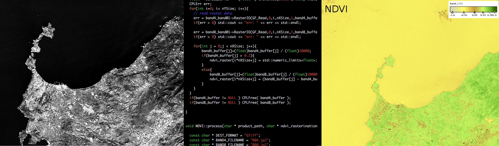
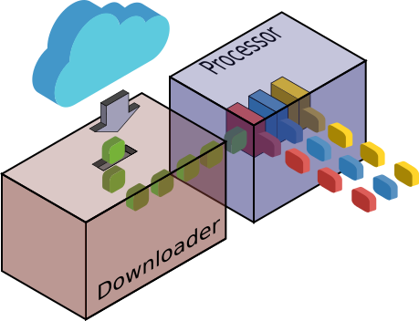
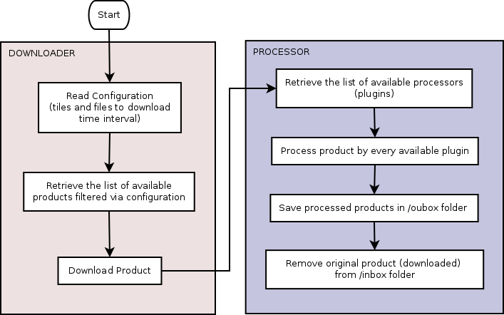

Welcome to Ichnosat
=============================

Ichnosat is an `Open Source <https://opensource.org/>`_ plugin based platform to
download an process satellite data written in
`Python <https://www.python.org/>`_ and C++, designed and developed by `Raffaele Bua <https://buele.github.io>`_ for `Sardegna Clima NPO <http://www.sardegna-clima.it>`_. Downloads and Processes are multithreaded and schedulable.
The Platform is configurable and the *processor* is extendible via C++ plugins.

`Docker <https://www.docker.com/>`_  containers are included in the package, facilitating the installation and running.

Source code is released under
the `MIT  <https://opensource.org/licenses/MIT>`_ license and it is available on `GitHub <https://github.com/SardegnaClimaOnlus/ichnosat/>`_.

The *downloader* gets automatically products from
`Sentinel-2 on AWS <http://sentinel-pds.s3-website.eu-central-1.amazonaws.com/>`_ portal. This downloader is multithreaded and
fully customizable.

The *processor* receives products from downloader
and processes products via C++ plugins. In the current
version the plugin available processes the  `NDVI <https://en.wikipedia.org/wiki/Normalized_Difference_Vegetation_Index>`_  exploiting
`GDAL <http://www.gdal.org/>`_  library.

Ichnosat *processor* is multithreaded, extendible
via C++ plugins and customizable.

|

|

|
|

|
|

- Cross-platform support
    - Ichnosat Platform provides the Docker containers

- Downloader
    - Get Sentinel-2 data from  `Sentinel-2 on AWS <http://sentinel-pds.s3-website.eu-central-1.amazonaws.com/>`_
    - Customizable properties:
        - Tiles to download
        - Files to download for each tile
        - Date interval (Sensing time)
        - Number of parallel downloads in the same time

- Processor
    - Plugin based: the processors are extendible C++ Shared Libraries
    - Customizable properties:
        - Number of parallel processing in the same time

- Ichnosat Platform
   - Automatic plugin compilation
   - HTTP APIs to manage the system
   - Customizable cron for scheduling run

- Graphical User Interface (Web based)
   - Run Downloader and Processor
   - Show product lists
   - Compile plugins
   - Manage Database

- Testing
   - Unit tests run at Platform start-up

- API-documentation
   - Autogenerated API-documentation via `Sphinx <http://www.sphinx-doc.org/>`_ from comments in the code (`PEP 257 Convention <https://www.python.org/dev/peps/pep-0257/>`_)

Index
=====
.. toctree::
   :maxdepth: 3

   documentation
   APIs <modules>
   downloads
   credits
   contacts
   ...

Download
-----------------
`Source Code  <https://github.com/SardegnaClimaOnlus/ichnosat/archive/master.zip>`_

Fork on GitHub
-----------------
`Ichnosat repository  <https://github.com/SardegnaClimaOnlus/ichnosat/>`_

