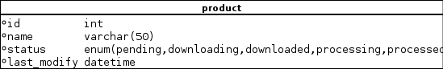

Software architecture
=====================

Overview
--------

The Ichnosat goal is to **Download** satellite data and **Process** this data automatically.
The high level workflow of the platform is simple:

|

.. image:: _static/overview.png
   :align: center

|

|
|

.. image:: _static/ichnosat-workflow.png
   :align: center

|
|

*Downloader* and *Processor* are the main modules of this platform. The schema with all modules involved follows:

|
|

|
|

Downloader
----------

This module is deputed to retrieve the list of available products and download them, on the basis of the configurations set by user.
The possible configurations to filter the list of products are:

- List of tiles
- List of files to download for each tile
- Sensing time interval (start - end )

Class diagram
~~~~~~~~~~~~~
|
|

.. image:: _static/downloader-class-diagram.png
   :align: center

|
|

Sequence diagram
~~~~~~~~~~~~~~~~

|
|

|
|

Processor
---------
The goal of this component is to process downloaded products.
Every processing algorithm is represented by C++ plugins. This means that *Processor* module is
extendible. Plugins are dynamic shared library (Linux environment)

The processor runs as http server to receive requests via http:

|
|

|
|

When the POST /process http is received the *Processor* starts a processing task, spreading a pool of threads.
The number of threads is configurable via *conf.cfg* file.

If you want to develop a new plugin
for your processing purposes, please follows the tutorial:

.. toctree::
   :maxdepth: 3

   how_to_create_a_new_plugin
   ...

Class diagram
~~~~~~~~~~~~~

|
|

.. image:: _static/processor-class-diagram.png
   :align: center

|
|

Sequence diagram
~~~~~~~~~~~~~~~~
|
|

.. image:: _static/processor-sequence-diagram.png
   :align: center

|
|

System Manager
--------------
System Manager is the high level module to manage other modules.

Class diagram
~~~~~~~~~~~~~

|
|

.. image:: _static/system_manager-class-diagram.png
   :align: center

|
|

Database
--------
Database module contains the classes of ORM.
In this version (0.1) is used *SqlAlchemy* ORM.

Class diagram
~~~~~~~~~~~~~

|
|

.. image:: _static/database-class-diagram.png
   :align: center

|
|

Database schema
~~~~~~~~~~~~~~~

|
|

|
|

Folder Structure
----------------

The description of the main folders in the source code follows:

.. code-block:: bash

   |-- Dockerfile             # Docker file of ichnosat platform
   |-- LICENSE.TXT            # MIT license text
   |-- README.md              # README of the project (for github main page)
   |-- auto-docs              # Documentation sources and images
   |-- data_local
   |   |-- db                 # Postgresql database files (mounted by docker-compose)
   |   |-- inbox              # Temporary downloaded products by the Downloader
   |   |-- log                # Ichnosat logs
   |   |-- outbox             # Processed products folder
   |   |-- supervisord        # Supervisord log folder
   |-- docker-compose.yml     # Docker Compose definition file
   |-- src
   |   |-- core               # Main Modules source code (Downloader, Processor, System Manager)
   |   |-- data               # Database and Logger source code
   |   |-- gui                # Web GUI interface source code
   |   |-- presentation       # External interface (http) source code
   |   `-- tests              # Tests
   `-- vendors                # Third part dependencies

External Inteface APIs
----------------------

|
|

|
|

Technologies
------------

- **Docker and docker compose**: virtual image container
- **SqlAlchemy**: ORM framework for python
- **Supervisord**: Task manager
- **Valgrind**: Process monitoring
- **Sphinx**: Automatic Documentation for python
- **Flask**: light webserver
- **Nginx**: web server
- **Postgresql**: database
- **GDAL**: C/C++ library for satellite image processing
- **OpenJPG**: library to manage jpeg2000 images
- **Python 3.4**
- **crontab**
- **debian**
- **pip**
- **C++11**

Code documentation
------------------
For more details about methods internals, please visit the section of *Code APIs* documentation:

.. toctree::
   :maxdepth: 10

   APIs <modules>
   ...

