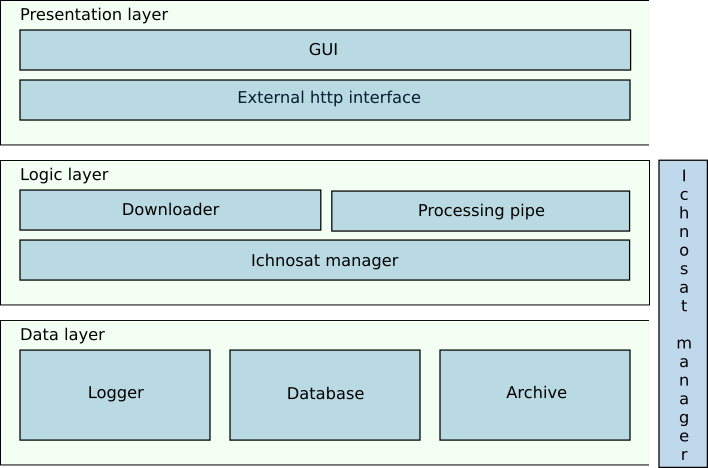
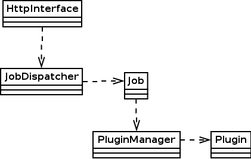

Ichnosat - Functional documentation
==============
# Introduction
**Ichnosat** is a software platform plugin based for downloading and processing sentinel-2 satellite images.

# Generic features

 - Download sentinel-2 products
  - Filtered download by date interval
  - Filtered download by tile  
 - Process satellite images
  - Sequential image processing

# Specific features
 - Cloud coverage processing, generating a geotiff raster images with cloud masks.
 - NDVI index processing, generating a geotiff raster image with Normalized Difference Vegetation Index.

# Workflow

# Software modules

##### GUI
The GUI is Web-client to monitor and to manage ichnosat activities.

##### Downloader
This module downloads sentinel-2 products from s3 sentinel-2.

##### Processing pipe
The processing pipe module manages steps of processing, making sure the parallelism between sub modules.

##### Ichnosat manager
This module orchestrates the other modules.

##### Logger
Logging system to keep track of ichnosat events.

##### Database
Module to manage the database of ichnosat.

##### Archive
This module contains the processed data.
